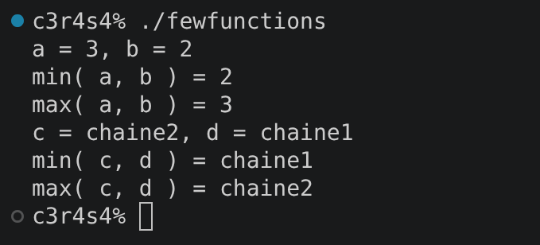
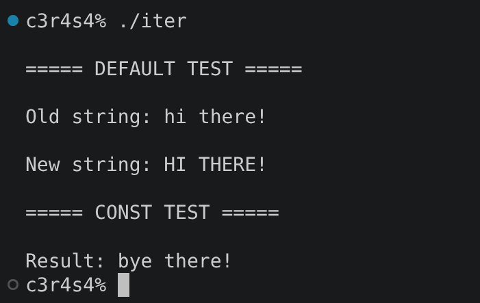
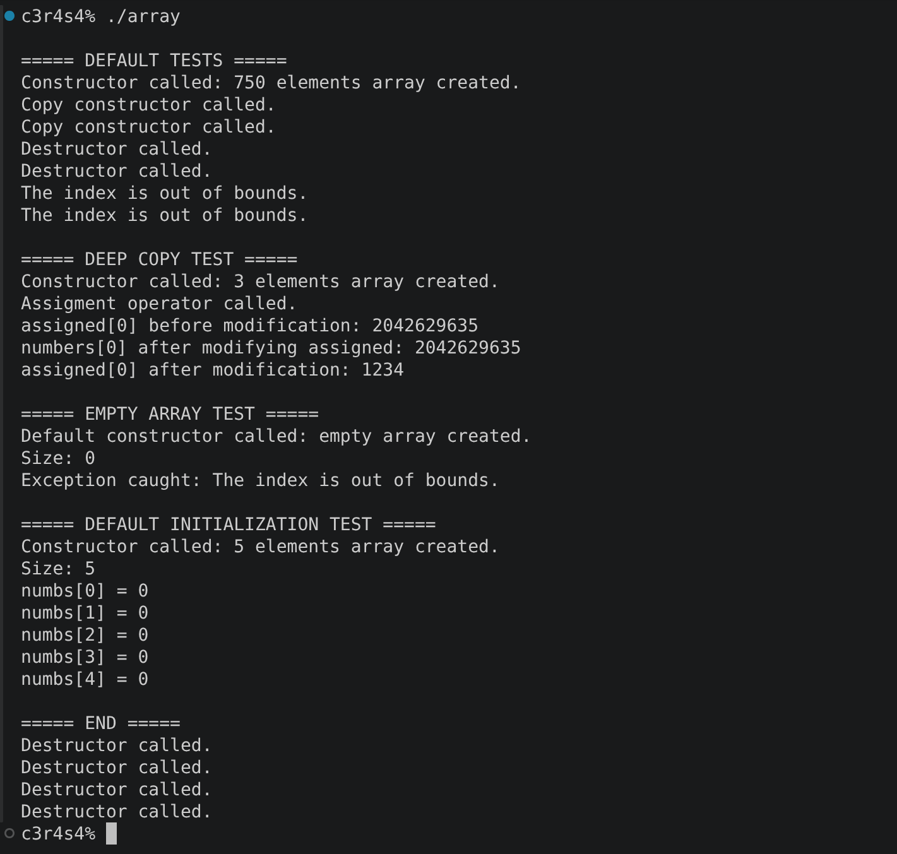

# cpp_module_07

### Clarifications and general tips:

* If you find any kind of error or have suggestions to improve, please do not hesitate to point them out in the `issues` section! Obviously always respectfully, thank you :D.
* Always remember that the output examples are just examples. They can vary in your own project and still be fine.

## ex00: Start with a few functions

### Mandatory requirements completed:

* The following function templates are implemented:
  * `swap`:
    * Swaps the values of two given parameters.
    * Does not return anything.
  * `min`:
    * Compares the two values passed as parameters and returns the *smallest* one.
    * If they are equal, it returns the second one.
  * `max`:
    * Compares the two values passed as parameters and returns the *greatest* one.
    * If they are equal, it returns the second one.
	* These functions can be called with arguments of any type.
	* The two arguments have the same type and support all the comparison operators.

### What can we learn about this exercise?:

The purpose of this exercise is to understand how **function templates** work in C++ and how they allow the same function to operate with different types while keeping the implementation generic.

### Output example:

## ex01: Iter

### Mandatory requirements completed:

* Implement a function template `iter` that:
  * Takes *three* parameters.
  	* Receives *the address of an array* as its first parameter.
  	* Receives *the length of the array* as its second parameter, passed as a `const` value.
	* Receives a *function* as its third parameter, which is called on every element of the array and can be an instantiated function template. Also, it may take its argument by `const` or `non-const` reference. Both options are implemented.
  * Returns nothing.

### What can we learn about this exercise?:

This exercise introduces the use of **function templates with arrays and function parameters**, as well as the difference between working with `const` and non-`const` elements.

### Output example:

## ex02: Array

### Mandatory requirements completed:

* Create a class template `Array` that contains elements of type `T`. The class implements:
  * A construction with no parameter that creates an empty array.
  * A construction with an `unsigned int n` parameter that creates an array of `n` elements initialized by default.
  * Copy construction and assignment operator. Modifications made to an original array or its copy do not affect the other array.
  * Memory allocation using `new[]`. No preventive allocation is used.
  * Elements are accessed through the subscript operator `[ ]`, and an `std::exception` is thrown when an index is out of bounds.
  * A `size()` member function that returns the number of elements in the array without modifying the current instance.
* Extra tests are included in `main.cpp` to verify the behavior of the class.

### What can we learn about this exercise?:

This exercise focuses on **class templates, dynamic memory management and deep copies** in C++. It also introduces bounds checking through exceptions in templates and the implementation of a generic array class that can work with different types.

### Output example:

#### Last but not least, check out these other repositories if you feel lost, they helped me a lot through the project:

https://github.com/tblaase/CPP-Module-07

https://gitlab.com/uotiug42/cpp-modules/cpp-module07/-/blob/main/ex02/includes/Array.hpp?ref_type=heads

ex01, debe de ser char y no string por que char son carácteres separados (más o menos)

